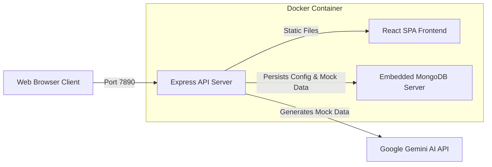

# 🚀 Stub API - Dynamic Mock API Generator

A full-stack developer utility tool designed to generate, mock, and control REST API endpoints on-the-fly. Powered by **Google Gemini AI**, the application lets developers specify what data model they want using natural language, dynamically registers matching endpoints, and provides mock API responses with customizable latency and HTTP error code injection.

The entire application is fully **Dockerized** into a single, self-contained container running the React frontend, Node.js/Express backend, and MongoDB.

---

## 🌟 Key Features

* **AI-Driven API Generation**: Describe the endpoint you need in plain English (e.g., *"/users with id, name, email, and role"*), and the built-in Gemini AI model will automatically analyze and build a mock database schema with realistic mock data.
* **Live Interactive Dashboard**: A premium, dark-themed UI (matching the IntelliJ IDE aesthetics) to view, test, and copy mock URLs.
* **Latency Simulation**: Test how your frontend behaves under slow network conditions. Set custom delays (e.g. `500ms`, `2000ms`) on any endpoint with one click.
* **Forced Error Simulation**: Force endpoints to return HTTP error codes (like `400 Bad Request`, `401 Unauthorized`, `404 Not Found`, or `500 Internal Server Error`) to test your client's error-handling logic.
* **Real-Time Database Storage**: Persists all generated endpoints and custom configurations in a MongoDB database.
* **Single-Container Deployment**: Fully packaged with an embedded MongoDB instance—run the entire stack anywhere with a single Docker command.

---

## 🏗️ Architecture & Technology Stack

The application is built using modern full-stack web standards:

* **Frontend**: React, Vite, Tailwind CSS v4, and Inter / JetBrains Mono typography.
* **Backend**: Node.js, Express (v5.x), and Mongoose ODM.
* **Database**: MongoDB (v6.0) community server.
* **AI engine**: `@google/generative-ai` (Gemini API Integration).
* **DevOps**: Docker multi-stage builds and custom shell process supervision.



---

## 🐳 Quick Start: Run Anywhere via Docker

You do not need to clone this repository, install Node.js, or configure a local MongoDB instance. You can run the entire application with a single command from your terminal:

### 1. Start the App
Run the following command (replace `your_gemini_api_key` with your actual Gemini API key):

```bash
docker run -d -p 7890:7890 -e GEMINI_API_KEY="your_gemini_api_key" -v stub-api-db-data:/data/db --name stub-api vaibhavpatel2505/stub-api:latest
```

* **`-d`**: Runs the container in the background (detached mode).
* **`-p 7890:7890`**: Maps port `7890` from the container to your host machine.
* **`-e GEMINI_API_KEY="..."`**: Injects your API key safely into the server environment.
* **`-v stub-api-db-data:/data/db`**: Mounts a Docker volume to persist MongoDB database files, ensuring your mock endpoints remain safe when the container restarts.

### 2. View Server Logs
To monitor the startup processes, see the database connections, and track incoming mock requests in real-time, run:

```bash
docker logs -f stub-api
```
*(The `-f` flag keeps the log stream open so you can see live logs as you interact with the app).*

### 3. Open the UI
Go to your browser and open:
**`http://localhost:7890`**

---

## ⚙️ How to Manage the Docker Container

* **Stop the container**:
  ```bash
  docker stop stub-api
  ```
* **Start it again**:
  ```bash
  docker start stub-api
  ```
* **Remove the container**:
  ```bash
  docker rm -f stub-api
  ```

---

## 🛠️ Local Development (Without Docker)

If you want to run the project locally for development purposes, you will need Node.js and MongoDB installed on your system.

### Step 1: Run the Backend
1. Navigate to the `backend` folder:
   ```bash
   cd backend
   ```
2. Install dependencies:
   ```bash
   npm install
   ```
3. Create a `.env` file inside the `backend` directory:
   ```env
   GEMINI_API_KEY=your_gemini_api_key
   MONGODB_URI=mongodb://localhost:27017/mockapi
   PORT=7890
   ```
4. Start the backend:
   ```bash
   npm run dev
   ```

### Step 2: Run the Frontend
1. Navigate to the `frontend` folder:
   ```bash
   cd ../frontend
   ```
2. Install dependencies:
   ```bash
   npm install
   ```
3. Start the dev server:
   ```bash
   npm run dev
   ```
   *The frontend dev server runs on `http://localhost:3001` and automatically proxies all API and mock requests to the backend on `http://localhost:7890`.*

---

## 🧠 DevOps & Containerization Highlights

This project showcases several advanced Docker concepts:

1. **Multi-Stage Dockerfile**: Uses a compilation container (`node:20 AS frontend-builder`) to build the React code. The final image only copies the build outputs (`dist/`), discarding unnecessary dependencies and minimizing the final image footprint.
2. **Process Management (PID 1 Isolation)**: The custom `docker-entrypoint.sh` executes the Node.js application using `exec node app.js`. This replaces the shell process and maps the Node process to PID 1, allowing the container to handle system termination signals (`SIGTERM`, `SIGINT`) gracefully for a clean shutdown.
3. **Embedded vs. External DB Flexibility**: The startup script automatically detects if a `MONGODB_URI` environment variable is provided. If it points to an external host, the container skips starting the local `mongod` daemon, enabling the image to connect seamlessly to external databases (like MongoDB Atlas).
